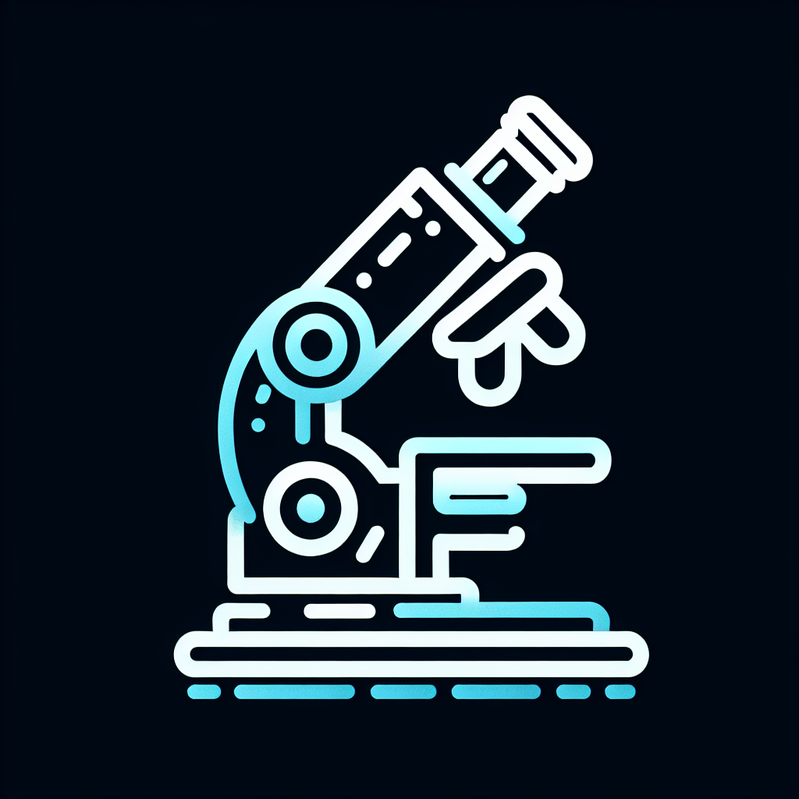

# NanoPharmaDynamics 🧬



An advanced AI-powered platform for optimizing nanoparticle design in pharmaceutical applications. This system combines machine learning with molecular modeling to predict and optimize nanoparticle properties for drug delivery systems.

## 🌟 Features

- **AI-Powered Optimization**: Utilizes GPT-4 for intelligent nanoparticle design suggestions
- **Multi-Parameter Analysis**: 
  - Stability Assessment
  - Toxicity Prediction 
  - Effectiveness Scoring
- **Interactive Visualization**: Dynamic visualization of nanoparticle properties and designs
- **Research Insights**: AI-generated research insights and recommendations
- **Real-time Chat Support**: Interactive chatbot for technical assistance

## 🚀 Getting Started

### Prerequisites

- Python 3.8+
- HTML, CSS, Javascript (for frontend components)
- OpenAI API key

### Installation

1. Clone the repository:
```bash
git clone https://github.com/yourusername/NanoPharmaDynamics.git
cd NanoPharmaDynamics
```

2. Create and activate a virtual environment:
```bash
python -m venv venv
source venv/bin/activate  # On Windows: venv\Scripts\activate
```

3. Install Python dependencies:
```bash
pip install flask flask-sqlalchemy pymysql openai werkzeug sqlalchemy
```

4. Set up environment variables:
```bash
# Create .env file
echo "OPENAI_API_KEY=your_api_key_here" > .env
echo "SESSION_SECRET=your_session_secret" >> .env
```

5. Initialize the database:
```bash
python app.py
```

## 🏗️ Project Structure

```
NanoPharmaDynamics/
├── app.py                 # Main Flask application
├── main.py               # Application entry point
├── models.py             # Database models
├── requirements.txt      # Python dependencies
├── services/            
│   ├── ai_models.py      # AI model implementations
│   ├── optimization_service.py  # Nanoparticle optimization
│   ├── visualization_service.py # Data visualization
│   ├── molecular_service.py    # Molecular processing
│   ├── openai_service.py      # OpenAI API integration
│   ├── data_service.py        # Data management
│   └── chatbot_service.py     # Chat support system
├── routes/
│   ├── main.py           # Main route handlers
│   └── api.py            # API endpoints
├── templates/            # HTML templates
├── static/              # Static assets
└── instance/            # Instance-specific files
```

## 🔬 Core Functionality

### Nanoparticle Optimization

The system evaluates three key properties:

1. **Stability Score**
   - Particle size optimization
   - Surface charge analysis
   - Coating material evaluation
   - Environmental stability factors

2. **Toxicity Assessment**
   - Size-dependent toxicity
   - Surface charge impact
   - Coating material safety
   - Biocompatibility metrics

3. **Effectiveness Rating**
   - Size-based effectiveness
   - Coating efficiency
   - Loading method compatibility
   - Drug delivery potential

### AI Integration

- GPT-4 powered optimization suggestions
- Machine learning-based property predictions
- Automated research insight generation
- Interactive chat support

## 📊 Data Models

- **Molecule**: Stores molecular structures and basic properties
- **NanoparticleOptimization**: Optimization results and scores
- **ResearchInsight**: AI-generated research findings
- **ChatSession**: User interaction history

## 🔧 API Endpoints

- `/api/optimize`: Nanoparticle optimization endpoint
- `/api/predict`: Property prediction endpoint
- `/api/insights`: Research insights endpoint
- `/api/chat`: Chat support endpoint

## 🛠️ Development

### Running Tests
```bash
python -m pytest tests/
```

### Development Server
```bash
python main.py
```

The development server will start at `http://localhost:5000`

## 📚 Documentation

Detailed documentation is available in the `/docs` directory:
- API Documentation
- User Guide
- Development Guide
- Best Practices

## 🤝 Contributing

1. Fork the repository
2. Create your feature branch (`git checkout -b feature/AmazingFeature`)
3. Commit your changes (`git commit -m 'Add some AmazingFeature'`)
4. Push to the branch (`git push origin feature/AmazingFeature`)
5. Open a Pull Request


## 🙏 Acknowledgments

- OpenAI for GPT-4 API
- Flask team for the web framework
- SQLAlchemy team for the ORM
- All contributors and supporters


---
⭐️ If you find this project useful, please consider giving it a star! 